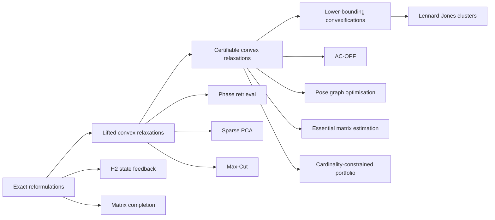

# Graded Benchmark Suite for Evaluating Agents That Convexify Non-Convex Optimization Problems

## Executive summary

A useful benchmark for an agent that converts non-convex problems into convex ones should not be a flat list of “hard optimisation problems.” It should be a ladder. At the low end, the suite should contain problems where the non-convexity is structural but removable by an exact change of variables, such as state-feedback H2 synthesis and nuclear-norm matrix completion. In the middle, it should contain problems where lifting or semidefinite relaxation is principled and often tight, such as phase retrieval, sparse PCA, and Max-Cut. At the high end, it should contain problems where convexification is still meaningful but only yields relaxations, certificates, or lower bounds, such as AC optimal power flow, pose graph optimisation, essential matrix estimation, cardinality-constrained portfolios, and Lennard-Jones cluster optimisation. That mix tests whether the agent can do exact reformulation, choose a strong relaxation, reason about tightness, and recover feasible primal solutions when the relaxation is not exact. citeturn12search15turn17search4turn35view2turn31view1turn19search3turn24search4turn34view1turn22search1turn29view1turn20search6

The suite recommended here contains ten benchmark families spanning control, signal processing, machine learning, combinatorial optimisation, power systems, robotics, computer vision, statistics, chemistry/physics, and finance. Two are rated **simple**, three **medium**, four **hard**, and one **extra-hard**. Each family comes with a mathematical formulation, a reason it is non-convex, a preferred convexification route, official or primary benchmark sources, baseline solvers, and suggested instance-generation knobs. The most important overall scores for the agent are: convexification correctness, relaxation tightness, recovered-solution feasibility, runtime, and scaling overhead after lifting. citeturn30search5turn36view0turn35view0turn32view2turn33view0turn34view1turn36view2turn29view1turn21search0

For a practical research workflow, I would treat the suite in three bands. Use the simple band as a smoke test for exact symbolic reformulation; use the medium band as a test of whether the agent knows the “standard convex surrogate” for a classical non-convex model; use the hard and extra-hard bands as a test of whether the agent can produce a defensible relaxation, explain what is lost, and attach an appropriate feasibility-recovery or certification procedure. citeturn12search15turn36view0turn35view2turn24search22turn34view1turn22search1turn29view1turn21search3

## Benchmark architecture

The suite is best understood as a progression from exact reformulations to lifted relaxations and then to lower-bounding convexifications.

This progression matters because “good convexification” means different things in different tiers. In the exact tier, success means algebraic equivalence. In the lifted tier, success means a strong convex program plus evidence of tightness, often rank-one recovery. In the certifiable tier, success means a usable lower bound and either a certificate of exactness or a principled rounding/recovery step. In the extra-hard tier, success may only mean a strong lower bound plus reliable local search seeded by the convexified model. citeturn12search15turn17search4turn35view2turn31view1turn19search3turn24search4turn34view1turn22search1turn29view1turn21search3

A benchmark harness for the agent should therefore log, for every transformed problem, at least five artefacts: the transformed convex model itself; the declared equivalence or relaxation type; the solver used; a recovered solution in the original variables; and a witness of quality such as a dual bound, a rank certificate, or a post-hoc feasibility residual. That separates model-generation skill from solver strength. citeturn35view0turn24search10turn34view1turn29view1

## Comparative table

The table below summarises the recommended benchmark families, their dominant variable types, the main convexification route, and the benchmark set I would actually use in practice.

| Problem family | Domain | Difficulty | Variables | Main non-convexity | Convexification most worth testing | Recommended benchmark/data source |
|---|---|---|---|---|---|---|
| H2 state-feedback synthesis | Control | Simple | Continuous | Bilinear matrix inequalities in \(K,P\) | Exact change of variables to LMI/SDP | COMPleib plants; MATLAB `h2syn` and LMI formulations citeturn16search0turn30search5turn27search2turn12search15 |
| Matrix completion | Machine learning | Simple | Continuous | Rank constraint or bilinear low-rank factorisation | Nuclear-norm relaxation; convex regularised completion | MovieLens datasets; `softImpute` citeturn28view0turn36view0turn18search4turn17search4 |
| Phase retrieval | Signal processing | Medium | Continuous, complex | Quadratic magnitude equations \(|a_i^*x|^2\) | PhaseLift, PhaseCut, PhaseMax | PhasePack; empirical transmission-matrix and Gaussian benchmarks citeturn35view0turn35view1turn35view2 |
| Sparse PCA | Statistics | Medium | Continuous | Sphere constraint plus cardinality/sparsity | SDP relaxation; \(\ell_1\)-penalised surrogates | DSPCA code; Pit Props and spiked-covariance models citeturn31view0turn31view1 |
| Max-Cut / QUBO | Combinatorial optimisation | Medium | Binary | Binary quadratic objective | Goemans-Williamson SDP; Burer-Monteiro factorisation | Gset; Biq Mac; Optsicom sets citeturn32view1turn32view2turn32view3turn19search3 |
| AC optimal power flow | Power systems | Hard | Continuous, complex | Bilinear/trigonometric AC power flow constraints | SDP, SOC, QC relaxations; OBBT | PGLib-OPF in MATPOWER format; PowerModels.jl citeturn33view0turn24search2turn24search4turn24search10 |
| Pose graph optimisation | Robotics | Hard | Continuous on manifolds | Rotation constraints \(R_i\in SO(d)\) | SDP relaxation with certification; chordal relaxation | SE-Sync; Carlone pose-graph datasets; g2o/KITTI citeturn34view1turn34view0turn34view2turn15search3 |
| Essential matrix estimation | Computer vision | Hard | Continuous on manifolds | Essential-manifold constraints \(E=[t]_\times R\), outliers | QCQP-to-SDP; orthogonal-space convex relaxations | ETH3D two-view data; OpenCV; npt-pose citeturn22search1turn22search13turn23search2turn36view2turn36view3 |
| Cardinality-constrained portfolio optimisation | Finance | Hard | Mixed | Binary cardinality and buy-in constraints with quadratic risk | MIQP/MISOCP; perspective reformulation; \(\ell_1\) surrogate | OR-Library port1–5; MOSEK and Gurobi examples citeturn29view0turn29view1turn26search0turn26search8turn37search16 |
| Lennard-Jones cluster optimisation | Chemistry/physics | Extra-hard | Continuous | Highly multimodal pairwise potential | \(\alpha\)BB-type convex underestimators; branch-and-bound lower bounds | Cambridge Cluster Database; GMIN citeturn20search6turn21search0turn21search1turn21search5turn21search3 |

## Simple tier

**H2 state-feedback synthesis for linear systems.** A clean control benchmark is full-state H2 synthesis written in its original bilinear form. One useful version is
\[
\min_{K,P\succ 0}\ \mathrm{tr}\!\big((Q+K^\top R K)P\big)
\]
subject to
\[
(A+BK)P + P(A+BK)^\top + W \preceq 0.
\]
The decision variables are the feedback gain \(K\in\mathbb{R}^{m\times n}\) and Lyapunov matrix \(P\in\mathbb{S}_{++}^n\). The objective is the H2/LQR-style quadratic performance measure; the constraint enforces closed-loop stability under white-noise or covariance-style disturbance modelling. It is non-convex because \(KP\) is bilinear and because the cost mixes \(K\) and \(P\). The standard exact convexification is \(Y=KP\), followed by a Schur complement to linearise the quadratic term, after which one solves an SDP/LMI and recovers \(K=YP^{-1}\). This is an excellent “sanity” benchmark because the agent should be able to derive the exact LMI, not merely a relaxation. Primary guidance comes from the LMI control literature and standard H2 synthesis formulations; official benchmark plants are available through COMPleib, and off-the-shelf baselines include Riccati-based solvers and toolbox implementations such as `h2syn`. citeturn12search15turn12search11turn27search2turn30search5turn16search0

Typical instances for benchmarking are state dimensions \(n=4,10,20,50\), with \(m\in\{1,\dots,\lfloor n/3\rfloor\}\), dense or sparse \(A\), and a controlled number of unstable open-loop eigenvalues. For synthetic generation, draw \(A=V\Lambda V^{-1}\) with 10 to 40 percent unstable modes, \(B\) Gaussian with full column rank, diagonal \(Q,R\succ0\), and \(W=I\). For real plants, select a graded subset from COMPleib, for example small plants first and then medium-order plants. The right metrics are: original-objective value after recovery, closed-loop spectral abscissa or discrete-time stability radius, primal feasibility of the Lyapunov inequality, SDP solve time, and the certificate that the transformed model is exact rather than relaxed. I would rate it **simple** because the convexification is exact and classical, even though numerical conditioning can still be nontrivial. citeturn16search0turn30search5turn12search15turn27search2

**Low-rank matrix completion.** A canonical machine-learning benchmark is
\[
\min_{X\in\mathbb{R}^{m\times n}} \frac12\|\mathcal P_\Omega(X-M)\|_F^2
\quad\text{s.t.}\quad \mathrm{rank}(X)\le r,
\]
or, in the noiseless form,
\[
\min_X \ \mathrm{rank}(X)\quad \text{s.t.}\quad \mathcal P_\Omega(X)=\mathcal P_\Omega(M).
\]
The decision variable is the complete matrix \(X\); the constraints are observation consistency on the sampled index set \(\Omega\). The problem is non-convex because rank is non-convex, and also because the common factorised model \(X=UV^\top\) is bilinear. The classical convex transformation is to replace rank with the nuclear norm,
\[
\min_X \ \|X\|_* \quad \text{s.t.}\quad \mathcal P_\Omega(X)=\mathcal P_\Omega(M),
\]
or the regularised noisy form solved efficiently by SOFT-IMPUTE. This is a very strong benchmark for an agent because it must recognise rank minimisation and select the nuclear norm, rather than, say, an arbitrary Frobenius surrogate. Primary theoretical references are the exact-recovery paper by Candès and Recht and the JMLR SOFT-IMPUTE paper. Official data are easy to obtain from the MovieLens page, which now spans from 100K through 32M ratings. citeturn17search4turn36view0turn28view0turn18search4

For grading, use synthetic rectangular matrices with \((m,n)\in\{(200,200),(1000,1000),(5000,2000)\}\), true rank \(r\in\{5,10,20,50\}\), observation probability \(p\in\{0.05,0.1,0.2,0.4\}\), and optional Gaussian noise \(\sigma\in\{0,10^{-3},10^{-2}\}\). For real benchmarks, use MovieLens 100K, 1M, 20M, and 32M in increasing order of scale. Baselines should include nuclear-norm models via `softImpute`, singular-value-thresholding methods, and alternating least squares or factorised low-rank baselines. The key metrics are held-out RMSE or MAE, objective value or regularised loss, runtime, recovered rank, and a convexification-fidelity score measuring whether the agent chose an exact or surrogate model and whether the surrogate was theoretically appropriate. I would rate it **simple** because the convex substitute is standard and widely accepted, though tightness depends on incoherence and sampling density. citeturn36view0turn17search4turn28view0turn18search4

## Medium tier

**Phase retrieval.** The classical signal-processing form is
\[
\min_{x\in\mathbb{C}^n}\ \sum_{i=1}^m \big(|a_i^*x|-b_i\big)^2
\]
or, in exact noiseless form, \(b_i=|a_i^*x|\). The decision variable is the complex signal \(x\); the constraints are magnitude-only measurement equations. The problem is non-convex because magnitudes of linear measurements produce quadratic equalities and global phase ambiguity. Two convexifications are especially important. The first is lifting, \(X=xx^*\), yielding the semidefinite program
\[
\min_{X\succeq 0}\ \mathrm{tr}(X)\quad \text{s.t.}\quad a_i^*Xa_i=b_i^2,
\]
which underlies PhaseLift. The second is PhaseMax, a convex program in the original dimension using an anchor vector \(\hat x\):
\[
\max_x \ \Re\langle x,\hat x\rangle \quad \text{s.t.}\quad |a_i^*x|\le b_i.
\]
PhasePack is the most convenient official benchmarking library because it exposes both convex and non-convex methods behind one interface and includes scripts for Gaussian and empirical transmission-matrix benchmarks. citeturn35view0turn35view1turn35view2

To grade instances, use \(n\in\{64,256,1024\}\), oversampling ratios \(m/n\in\{2,4,6\}\), Gaussian sensing, coded diffraction masks, and one empirical transmission-matrix benchmark. Baselines should include PhaseLift, PhaseMax, Wirtinger Flow, Truncated Wirtinger Flow, Gerchberg-Saxton, and Fienup, all of which are bundled in PhasePack. For evaluation, use phase-invariant relative reconstruction error \(\min_\phi \|x-e^{j\phi}\hat x\|/\|x\|\), measurement residual, rank of the lifted solution, runtime, and memory blow-up from lifting. I would rate it **medium** because the convexification is principled but can be expensive, and because model choice between lifting and anchor-based convexification materially changes scalability. citeturn35view0turn35view1turn35view2

**Sparse PCA.** A standard one-component sparse PCA benchmark is
\[
\max_{x\in\mathbb{R}^p}\ x^\top \Sigma x
\quad \text{s.t.}\quad \|x\|_2=1,\ \|x\|_0\le k.
\]
The decision variable is the loading vector \(x\); the objective maximises explained variance; the sparsity budget \(k\) enforces interpretability. This is non-convex because of the sphere constraint combined with the \(\ell_0\) sparsity constraint. The direct SDP relaxation introduced in the DSPCA line of work lifts \(X=xx^\top\) and drops the rank-one constraint:
\[
\max_{X\succeq 0}\ \mathrm{tr}(\Sigma X)
\quad \text{s.t.}\quad \mathrm{tr}(X)=1,\ \mathbf 1^\top |X| \mathbf 1 \le k.
\]
This is a very good benchmark for an agent because it must recognise that the correct convexification is not generic \(\ell_1\) shrinkage alone; the semidefinite structure is part of the problem. The official DSPCA page includes author code, and the original paper documents both synthetic and real-data tests, including the Pit Props benchmark. citeturn31view0turn31view1

Recommended synthetic instances are spiked covariance models with \(p\in\{100,500,2000\}\), support size \(k\in\{5,20,50\}\), sample count \(N\in\{200,1000,5000\}\), and signal strengths between 1.5 and 5 times the noise level. Real benchmarks should include Pit Props and at least one finance-style covariance matrix because sparse PCA is often used there. Baselines are DSPCA, PathSPCA, classical PCA with thresholding, standard SPCA variants, and `SparsePCA`-style practical algorithms. Use explained variance, support recovery F1 on synthetic data, sparsity level, runtime, and if using the SDP, post-recovery rank and duality gap. I would rate it **medium** because the convexification is elegant and standard, but tightness degrades as \(p\) grows and multiple-component variants become much harder. citeturn31view0turn31view1

**Max-Cut and general binary quadratic optimisation.** The weighted Max-Cut problem can be written as
\[
\max_{s_i\in\{-1,1\}}\ \frac14\sum_{(i,j)\in E} w_{ij}(1-s_is_j).
\]
The decision variables are binary signs or, equivalently, a cut partition; the objective is total cut weight. The problem is non-convex because it is a binary quadratic programme. The canonical convex relaxation is the Goemans-Williamson SDP,
\[
\max_{X\succeq 0}\ \frac14\sum_{(i,j)\in E} w_{ij}(1-X_{ij})
\quad \text{s.t.}\quad X_{ii}=1 \ \forall i,
\]
followed by hyperplane rounding. This benchmark is indispensable because it tests whether the agent knows one of the most important convex relaxations in optimisation. Primary sources are the original Goemans-Williamson paper, the Gset collection, and the Biq Mac library for exact branch-and-bound plus semidefinite bounds. citeturn19search3turn32view1turn32view2turn32view3

For generation, use Erdős-Rényi graphs with \(n\in\{200,1000,3000\}\), edge probabilities \(p\in\{0.01,0.05,0.1\}\), and weights in \(\{\pm1\}\) or Gaussian. For official benchmarks, use Gset first, then the Biq Mac library and the Optsicom grouped instances. Baselines should include GW SDP, local search, scatter search, rank-two or low-rank Burer-Monteiro methods, and Biq Mac for exact small or medium cases. The right scores are cut value, ratio to SDP upper bound, ratio to exact optimum when known, runtime, and violation of rounded-solution feasibility, which should be zero because rounding returns a cut. I would rate it **medium** because the convexification is textbook, but the gap between the SDP upper bound and the rounded primal solution remains central. citeturn19search3turn32view1turn32view2turn32view3

## Hard tier

**AC optimal power flow.** A standard polar-voltage AC-OPF benchmark is
\[
\min_{V,\theta,P_G,Q_G}\ \sum_{i\in\mathcal G} c_i(P_{G,i})
\]
subject to AC power-balance equations
\[
P_{G,i}-P_{D,i}=V_i\sum_j V_j(G_{ij}\cos\theta_{ij}+B_{ij}\sin\theta_{ij}),
\]
\[
Q_{G,i}-Q_{D,i}=V_i\sum_j V_j(G_{ij}\sin\theta_{ij}-B_{ij}\cos\theta_{ij}),
\]
plus generator, voltage, thermal-limit, and angle-difference bounds. The decision variables are complex bus voltages and generator injections. The model is non-convex because of bilinear voltage products and trigonometric coupling. The most important convexifications are the semidefinite relaxation in \(W=vv^H\), second-order cone relaxations, and the quadratic-convex relaxation; in practice, bound tightening is often required to make the relaxations useful. Official benchmark instances come from PGLib-OPF in MATPOWER format, with open-source implementations in MATPOWER and PowerModels.jl. PGLib now contains cases spanning toy to very large grids, including cases with as few as 3 buses and stress cases with tens of thousands of buses. citeturn33view0turn24search2turn24search4turn24search10turn24search19

For benchmarking, I recommend three scales: toy cases 14 to 118 buses; medium cases 300 to 2000 buses; and hard cases 3000 to 10000 buses, with at least one stress case above that. Use both base cases and the `api` and `sad` variants from PGLib because they stress different convex relaxations. Baselines should include nonlinear local solvers through MATPOWER/IPOPT, and convex baselines through PowerModels.jl with SOC, QC, and SDP formulations. The central metrics are objective upper and lower bounds, optimality gap \((f_{\text{primal}}-LB)/\max(1,|LB|)\), AC feasibility after recovery, runtime, memory, and relaxation rank or exactness. I would rate it **hard** because the relaxations can be excellent on some instances and weak on others, making “choose the right convexification” part of the benchmark itself. citeturn33view0turn24search4turn24search10turn24search22

**Pose graph optimisation.** A standard robotics formulation for \(d\in\{2,3\}\) is
\[
\min_{\{R_i,t_i\}}\ \sum_{(i,j)\in E}
\|R_j-R_i\tilde R_{ij}\|_{\Omega^R_{ij}}^2
+
\|t_j-t_i-R_i\tilde t_{ij}\|_{\Omega^t_{ij}}^2
\]
subject to \(R_i\in SO(d)\). The decision variables are robot poses \((R_i,t_i)\); the graph edges encode relative pose measurements. The problem is non-convex because \(SO(d)\) is non-convex and because rotations couple nonlinearly with translation terms. The strongest convexification in practical use is the semidefinite relaxation behind SE-Sync, which can be exact under moderate noise and comes with a posteriori certificates. Standard local baselines are Gauss-Newton or Dog-Leg solvers in g2o and related SLAM frameworks. Official pose-graph datasets are distributed on the Carlone dataset page, including 2D sets such as INTEL and M3500 and 3D sets such as sphere, torus, garage, cubicle, and rim; more general nonlinear graph optimisation baselines are in g2o, and KITTI odometry is a useful downstream large-scale dataset. citeturn34view1turn34view0turn34view2turn15search3

Suggested synthetic generation is straightforward: node count \(N\in\{100,1000,10000\}\), loop-closure probability 0.05 to 0.2, rotational noise 0.5 to 5 degrees RMS, and translational noise 0.01 to 0.1 times average edge length. For official real instances, start with INTEL and M3500, then use 3D garage and cubicle, and finally KITTI-derived pose graphs. Baselines should include g2o or GTSAM local search and SE-Sync as the certifiable convex-relaxation baseline. Use trajectory RMSE when ground truth exists, objective value, certification rate, relative suboptimality bound from the relaxation, runtime, and failure rate under poor initialisation. I would rate it **hard** because the convexification is excellent but not universally exact, and because manifold structure plus graph sparsity matters a great deal. citeturn34view1turn34view0turn34view2

**Essential matrix estimation from calibrated correspondences.** For \(N\) inlier correspondences \((q_i,q_i')\), a common non-minimal formulation is
\[
\min_{E}\ \sum_{i=1}^{N} (q_i'^{\top} E q_i)^2
\]
subject to \(E=[t]_\times R\), \(R\in SO(3)\), and \(\|t\|_2=1\). Equivalent polynomial constraints include \(\det(E)=0\) and the singular-value constraints that define the essential manifold. The decision variable is the \(3\times 3\) essential matrix or the underlying \((R,t)\). The problem is non-convex because of the essential-manifold constraints and because robust variants also introduce outliers. The important convexification routes are the QCQP-to-SDP relaxation for the non-minimal \(N\)-point problem and the more recent orthogonal-space convex relaxation. Practical local baselines remain five-point or RANSAC methods, exposed in OpenCV. Official or primary implementations and data are available via the author’s `npt-pose` repository, the OpenCV `findEssentialMat` interface, and ETH3D two-view or multiview benchmark data. citeturn22search1turn22search13turn36view2turn36view3turn23search2

For instance generation, vary the number of correspondences \(N\in\{20,50,200,1000\}\), inlier ratio in \(\{1.0,0.8,0.5\}\), image noise 0.25 to 2 pixels, and planar versus generic scene geometry. On real data, use ETH3D and, if desired, pose pairs extracted from KITTI odometry. Baselines should include OpenCV five-point plus RANSAC, least-squares refinement, and the author’s SDP-based non-minimal solver. The right task-specific metrics are angular rotation error, translation-direction error, Sampson or epipolar residual, inlier count, runtime, and, for the relaxation, rank/tightness of the lifted solution. I would rate it **hard** because the convexification is strong but problem geometry, outliers, and near-degenerate scenes strongly affect performance. citeturn22search1turn36view2turn36view3turn23search2

**Cardinality-constrained mean-variance portfolio optimisation.** A standard long-only formulation is
\[
\max_{x,y}\ \mu^\top x
\]
subject to
\[
\mathbf 1^\top x = 1,\quad x^\top \Sigma x \le \gamma^2,\quad l_i y_i \le x_i \le u_i y_i,\quad
\sum_i y_i \le K,\quad y_i\in\{0,1\}.
\]
If transaction costs are included, one introduces trade variables \(z_i\) or \(\Delta x_i\) with fixed or variable-cost terms. The decision variables are portfolio weights \(x\) and binary asset-selection variables \(y\). The model is non-convex because of cardinality, buy-in, and fixed-cost structure; with long-only risk constraints it becomes an MIQP or MISOCP rather than a smooth non-convex continuous problem. The correct “convexification” question for the agent is whether it can recognise and isolate the convex quadratic risk term, then produce a mixed-integer conic or quadratic model, or a perspective-strengthened relaxation, rather than treating the whole model as generic non-convex programming. Official modelling examples are available in MOSEK and Gurobi documentation, and the classic public benchmark set is the OR-Library data used by Chang et al. citeturn29view1turn26search0turn26search8turn29view0turn11search0

For benchmarking, use the OR-Library port1–port5 instances first; the public summaries commonly report 31, 85, 89, 98, and 225 assets, which is a good graded ladder. For synthetic tests, use factor-model covariances with \(n\in\{100,500,2000\}\), factor count \(k_f\in\{5,20\}\), cardinality \(K\in\{10,25,50\}\), and optional buy-in thresholds 0.5 to 2 percent. Baselines should include exact MIQP/MISOCP via official solver examples, plus heuristic search if you want a non-convex baseline. Evaluate expected return, realised variance or standard deviation, optimality gap against the best lower bound, budget and buy-in feasibility, realised cardinality, and runtime. I would rate it **hard** because a good transformation depends on whether the agent chooses a mixed-integer convex model, a relaxation, or a heuristic \(\ell_1\) proxy, and those choices are not equivalent. citeturn29view1turn29view0turn37search16turn26search0turn26search8

## Extra-hard tier

**Lennard-Jones cluster optimisation.** The standard atomistic benchmark is
\[
\min_{x_1,\dots,x_N\in\mathbb{R}^3}\ \sum_{1\le i<j\le N}
4\epsilon\Big[\Big(\frac{\sigma}{\|x_i-x_j\|}\Big)^{12}
-
\Big(\frac{\sigma}{\|x_i-x_j\|}\Big)^6\Big].
\]
The decision variables are \(3N\) atom coordinates, usually with translation and rotation removed by centring or gauge-fixing. The constraints may be empty or may include a bounding box for deterministic global optimisation. This is non-convex for a harder reason than most problems in the suite: the landscape is extremely multimodal, with multiple structural families and difficult funnel transitions. The Cambridge Cluster Database explicitly notes that certain cluster sizes, especially \(N=38\) and the Marks-decahedral sizes \(N=75\) to \(77\) and \(102\) to \(104\), are stiff tests for global optimisation algorithms. The most successful practical baselines are basin-hopping methods, distributed in GMIN. Convexification exists, but mainly as lower-bounding machinery, especially \(\alpha\)BB-style convex underestimators and branch-and-bound; these are valuable for certification, not as universally tight reformulations. citeturn20search6turn21search1turn21search5turn21search0turn21search3

For grading, use \(N\in\{13,38,55,75,98,150\}\). LJ\(_{13}\) and LJ\(_{55}\) are relatively forgiving; LJ\(_{38}\) and LJ\(_{75}\) are much more deceptive and are better “convexification stress tests”; LJ\(_{98}\) and 150 push into truly difficult territory. Start from random coordinates in a cube, optionally normalise the centre of mass to zero, and compare recovered energies to best-known minima from the Cambridge tables. Baselines should include GMIN basin-hopping, genetic or evolutionary baselines if desired, and any deterministic lower-bounding method your lab prefers. The core metrics are best energy found, gap to best-known minimum, success probability over many restarts, runtime to target energy, and if a convex lower bound is used, a mathematically valid lower-bound gap. I would rate it **extra-hard** because the convexification is inherently weak and the benchmark probes whether the agent can still produce useful convex lower bounds or decompositions in a landscape where exact lifting is unrealistic. citeturn20search6turn21search1turn21search5turn21search0turn21search3

## Evaluation protocol and limitations

A good benchmark report card for the convexifying agent should use the same global template across all ten families. For each instance, compute: the original objective at the recovered solution \(f(x_{\text{rec}})\); a lower bound \(LB\) from the convex relaxation or dual; the normalised optimality gap
\[
\mathrm{gap}=\frac{f(x_{\text{rec}})-LB}{\max(1,|LB|)};
\]
a feasibility residual measured in original variables; total wall-clock time split into model-generation time and solver time; and convexification overhead, for example lifted-variable count divided by original-variable count. For exact reformulations, the gap should collapse to numerical tolerance; for strong relaxations, you should also log rank or certificate information; for mixed-integer convexifications, report branch-and-bound node counts and incumbent quality over time. citeturn29view1turn35view2turn34view1turn24search10

I also recommend three cross-problem agent metrics that are often missed. First, **convexification fidelity**: did the agent produce an exact reformulation, a lower bound, or a heuristic surrogate, and did it say which it produced? Second, **recovery quality**: when the convex model is only a relaxation, how good is the rounded or projected solution in the original model? Third, **instance-scaling competence**: does the agent avoid lifted SDPs when a cheaper but still principled convexification exists, such as PhaseMax instead of PhaseLift on large phase-retrieval instances, or QC/SOC relaxations instead of full SDP on large AC-OPF cases? citeturn35view2turn24search4turn24search22turn34view1

The main limitations of this suite are not defects; they are intrinsic properties of the underlying theory. Exact convexification exists only for some families and only under assumptions in others. Matrix completion depends on incoherence and sampling; phase retrieval depends on measurement design and oversampling; SDP exactness in pose graph optimisation and essential matrix estimation degrades under adversarial noise or degeneracy; AC-OPF relaxations vary sharply in strength across network classes and operating regimes; and Lennard-Jones convexification is fundamentally lower-bounding rather than exact. Those limitations should be reported, not hidden, because an honest agent must know when it has produced an equivalent convex model and when it has only produced a bound or a surrogate. citeturn17search4turn35view2turn34view1turn22search1turn24search4turn21search3

If I were implementing this suite immediately, I would start with a **core regression pack** of seven families: H2 control, matrix completion, phase retrieval, sparse PCA, Max-Cut, AC-OPF, and pose graph optimisation. Then I would add essential matrix estimation and portfolio optimisation for mixed continuous-discrete structure, and reserve Lennard-Jones as the challenge benchmark for research iterations rather than daily CI. That ordering gives a good balance between mathematically exact reformulations, mainstream convex relaxations, and frontier-grade hard cases. citeturn12search15turn36view0turn35view0turn31view1turn19search3turn33view0turn34view1turn36view2turn29view1turn21search0